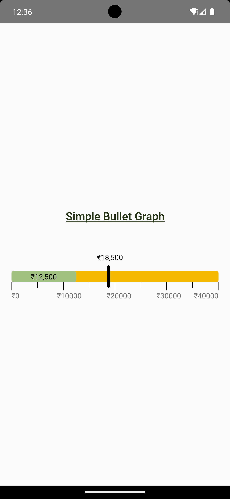
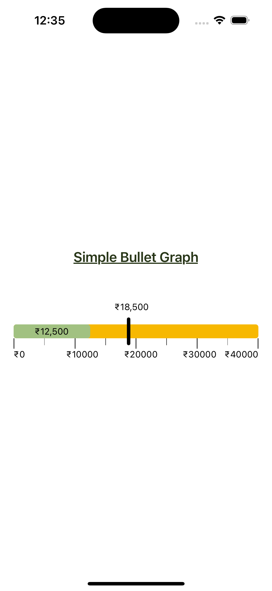

# react-native-bullet-graph

Component for adding bullet graphs to your React Native apps.

## Demo 📱

<table>
  <tr>
  
<td>
<h6>Android</h6>

</td>

<td>
<h6>iOS</h6>

</td>
</tr>
</table>

## Installation

```js
npm install react-native-bullet-graph
```

## Usage

Follow the example below to use the graph:

```js
import { SimpleBulletGraph } from "react-native-bullet-graph";

// Data required to setup the graph
var bulletGraphData = {
  upper: 40000, // upper value defines the maximum value of the graph
  actual: 12500, // actual value defines the progress
  target: 18500, // target value to set the target
};

const App = () => {
  return (
    <SimpleBulletGraph
      data={bulletGraphData}
      targetBarHeight={40}
      targetBarWidth={5}
      targetBarColor={colors?.black}
      barHeight={20}
      barWidth={90}
      actualBarColor={colors?.green}
      barColor={colors?.yellow}
      targetTextColor={colors?.black}
      actualTextColor={colors?.black}
      barBorderRadius={4}
      numericSize={13}
      timelineFontSize={13}
      hideActualValue={false}
      hideTargetValue={false}
      numberPrefix={"₹"}
      internationalNumberSystem={false}
    />
  );
};
```

## Configuration

Available props to configure the graph according to your needs:
Name | Type | Default value | Description
----------------- |------------------------|-------------------------|--------------
data | object | null | Mandatory data prop which will contain upper, actual and target values
targetBarHeight | number | 40 | Height of the target bar
targetBarWidth | number | 5 | Width of the target bar
targetBarColor | string | "#000000" | Fill color for target bar
barHeight | number | 20 | Height of the main bar, values must be entered in pixels
barWidth | number | 90 | Width of the main bar, values will be entered used as percentage and not as pixels
actualBarColor | string | "#a1c181" | Fill color for denoting actual progress value
barColor | string | "#f7b801" | Fill color for the main bar
targetTextColor | string | "#000000" | Text color of the target amount shown on bar
actualTextColor | string | "#000000" | Text color of the target amount shown on bar
barBorderRadius | number | 10 | Border radius of entire graph
numericSize | number | 12 | Font size of target and actual values
timelineFontSize | number | 12 | Font size of timeline values
hideActualValue | boolean | false | Show or hide the actual value shown on bar
hideTargetValue | boolean | false | Show or hide the target value shown on bar
numberPrefix | string | null | Prefix value to be added to all values
internationalNumberSystem | boolean | true | 2 or 3 digit comma separator for numeric values

## License

MIT
