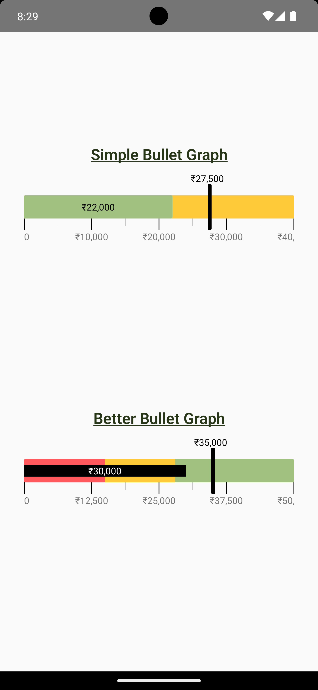

# react-native-bullet-graph

Add customizable bullet graphs to your React Native apps.

## Demo 📱

<table>
  <tr>
  
<td>
<h6>Android</h6>

</td>

<td>
<h6>iOS</h6>

</td>
</tr>
</table>

## Installation 🚀

```js
npm install react-native-bullet-graph
```

## Usage

Follow the example below to use the graph:

```js
import {
  SimpleBulletGraph,
  BetterBulletGraph,
} from "react-native-bullet-graph";

// Data required for setup of Simple Bullet Graph
var simpleBulletGraphData = {
  upper: 40000, // upper value for the upper range
  actual: 22000, // actual value for the current progress
  target: 27500, // target value for expected target
};

// Data required for setup of Better Bullet Graph
var betterBulletGraphData = {
  upper: 50000,
  actual: 30000,
  target: 35000,
  lower: 15000, // lower value for the bad range
  medium: 28000, // medium value for the satisfactory range
};

const App = () => {
  return (
    <>
      <SimpleBulletGraph
        data={simpleBulletGraphData}
        barHeight={30}
        barWidth={85}
        barColor={colors?.yellow}
        barBorderRadius={2}
        targetBarHeight={60}
        targetBarWidth={5}
        targetBarColor={colors?.black}
        targetTextColor={colors?.black}
        actualBarColor={colors?.green}
        actualTextColor={colors?.black}
        numericSize={12}
        timelineFontSize={12}
        hideActualValue={false}
        hideTargetValue={false}
        numberPrefix={"₹"}
        internationalNumberSystem={false}
        hideScale={false}
      />

      <BetterBulletGraph
        data={betterBulletGraphData}
        barHeight={30}
        barWidth={85}
        barColor={colors?.green}
        barBorderRadius={2}
        targetBarHeight={60}
        targetBarWidth={5}
        targetBarColor={colors?.black}
        targetTextColor={colors?.black}
        actualBarColor={colors?.black}
        actualTextColor={colors?.white}
        actualBarHeight={15}
        lowerBarColor={colors?.red}
        mediumBarColor={colors?.yellow}
        numericSize={12}
        timelineFontSize={12}
        hideActualValue={false}
        hideTargetValue={false}
        numberPrefix={"₹"}
        internationalNumberSystem={false}
        hideScale={false}
      />
    </>
  );
};
```

## Configuration

Available props to configure the graph according to your needs:
Name | Type | Default value | Description
----------------- |------------------------|-------------------------|--------------
data | `Object` (required) | null | Mandatory data prop which will contain upper, actual and target values
barHeight | `Number` | 20 | Height of the main bar, values must be entered in pixels
barWidth | `Number` | 90 | Width of the main bar, values will be entered used as percentage and not as pixels
barColor | `String` | "#f7b801" | Fill color for the main bar
barBorderRadius | `Number` | 10 | Border radius of entire graph
targetBarHeight | `Number` | 40 | Height of the target bar
targetBarWidth | `Number` | 5 | Width of the target bar
targetBarColor | `String` | "#000000" | Fill color for target bar
targetTextColor | `String` | "#000000" | Text color of the target amount shown on bar
actualBarColor | `String` | "#a1c181" | Fill color for denoting actual progress value
actualTextColor | `String` | "#000000" | Text color of the target amount shown on bar
actualBarHeight | `Number` | 15 | Height of actual bar (Performance Bar)
lowerBarColor | `String` | "ff595e" | Fill color for the Lower bar (Bad Range)
mediumBarColor | `String` | "ffca3a" | Fill color for the Medium bar (Satisfactory Range)
numericSize | `Number` | 12 | Font size of target and actual values
timelineFontSize | `Number` | 12 | Font size of timeline values
hideActualValue | `Boolean` | false | Show or hide the actual value shown on bar
hideTargetValue | `Boolean` | false | Show or hide the target value shown on bar
numberPrefix | `String` | null | Prefix value to be added to all values
internationalNumberSystem | `Boolean` | true | 2 or 3 digit comma separator for numeric values
hideScale | `Boolean` | false | Show or hide range scale

## License

MIT
